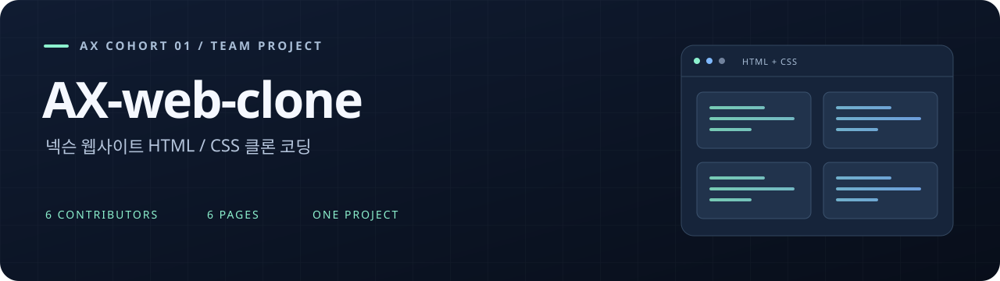
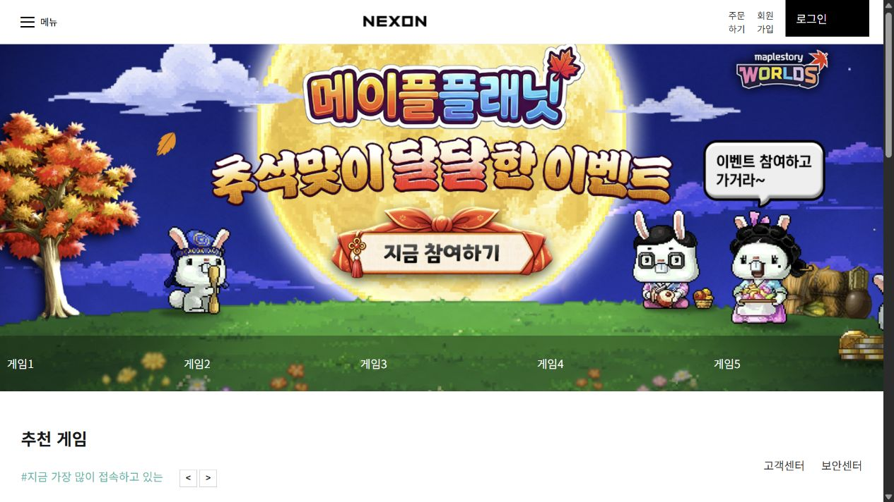
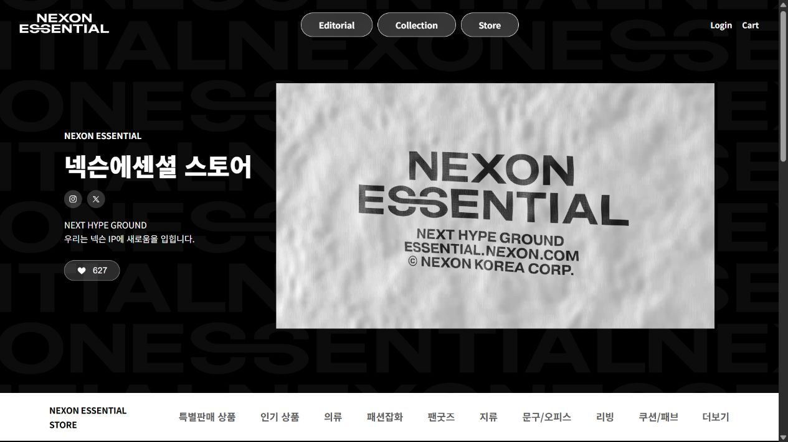
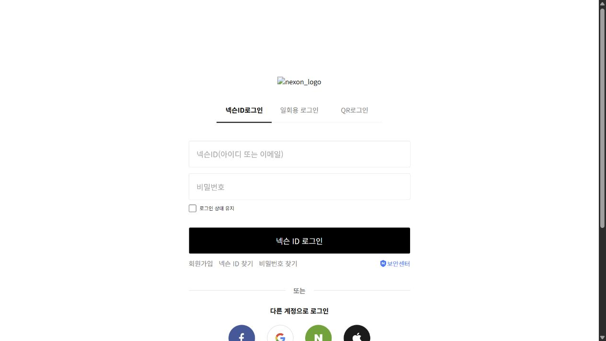
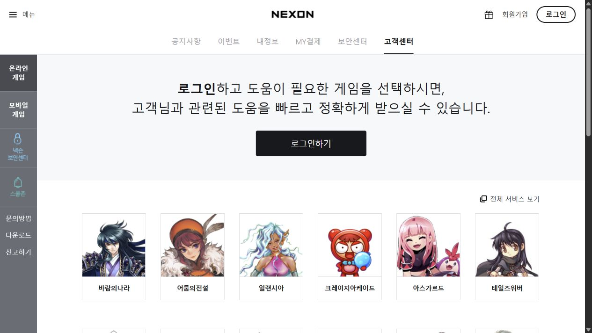
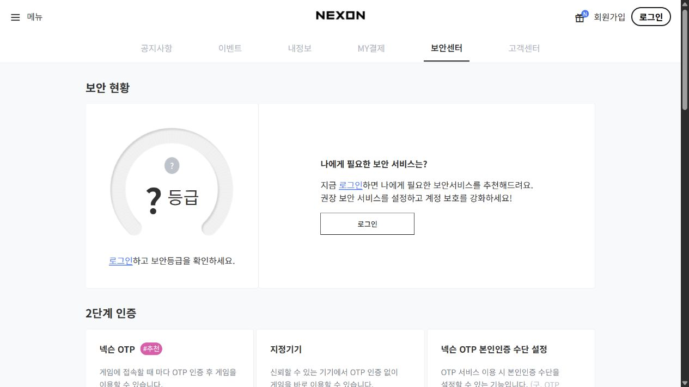
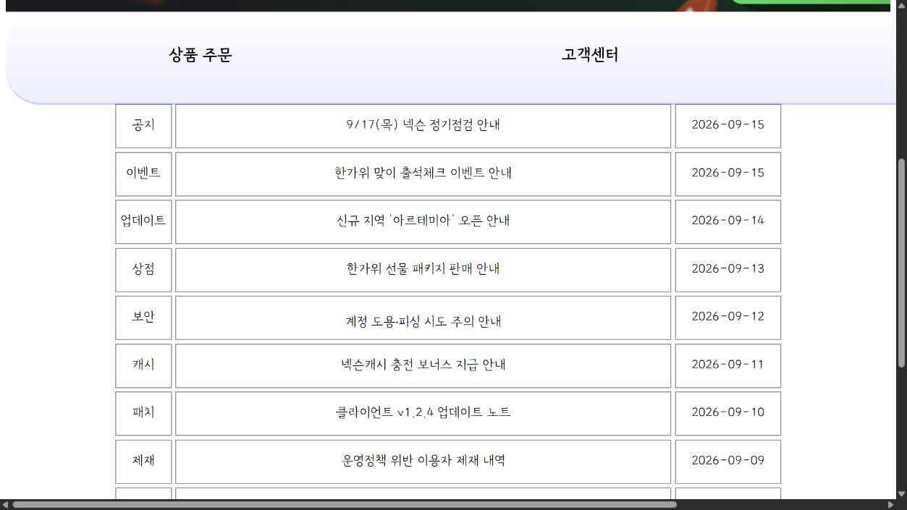

<p align="center">
  
</p>

<p align="center">
  
  
  
  
</p>

<p align="center">
  <b>여섯 명의 페이지를 하나의 웹 프로젝트로.</b><br>
  넥슨 웹사이트의 화면을 나누어 구현한 HTML/CSS 팀 프로젝트
</p>

<p align="center">
  <a href="#화면-미리보기">화면 미리보기</a> / <a href="#팀원과-역할-분담">팀 소개</a> / <a href="#협업-과정">협업 과정</a> / <a href="#실행-방법">실행 방법</a>
</p>

## 프로젝트 소개

AX 1기 팀원 6명이 넥슨 웹사이트의 주요 화면을 나누어 HTML과 CSS로 구현한 학습 프로젝트입니다. 로그인, 메인, 상품 목록, 고객센터, 보안센터, 공지사항을 각각 제작하고, GitHub의 작업 브랜치와 Pull Request를 통해 하나의 저장소로 통합했습니다.

각 페이지의 레이아웃, 여백, 글꼴, 색상과 UI 요소를 구성하며 HTML/CSS를 연습했습니다. 구현 범위는 정적인 화면과 페이지 연결이며, 실제 로그인 인증, 주문 처리, 결제나 데이터 저장은 포함하지 않습니다.

| 구성 | 내용 |
| --- | --- |
| 참여 | AX 1기, 6인 팀 |
| 구현 | HTML5, CSS3로 제작한 6개 페이지와 시작 화면 |
| 협업 | Git, GitHub, 페이지별 작업 브랜치, Pull Request |
| 시작점 | [index.html](index.html)에서 모든 페이지로 이동 |

## 화면 미리보기

로컬 리소스를 포함한 실행 환경에서 캡처한 실제 구현 화면입니다. 이미지를 누르면 크게 볼 수 있습니다.

<table>
  <tr>
    <td width="50%"><a href="docs/readme/02-main.png"></a><br><b>02 / 메인</b> — 장예지<br>대표 배너, 게임 카드, 페이지 연결</td>
    <td width="50%"><a href="docs/readme/03-store.png"></a><br><b>03 / 상품 목록</b> — 김민지<br>스토어 소개, 영상, 상품 카드</td>
  </tr>
  <tr>
    <td><a href="docs/readme/01-login.png"></a><br><b>01 / 로그인</b> — 원정린<br>로그인 유형 선택, 입력 폼, 소셜 버튼</td>
    <td><a href="docs/readme/04-support.png"></a><br><b>04 / 고객센터</b> — 양석호<br>사이드바, 로그인 안내, 게임별 문의 카드</td>
  </tr>
  <tr>
    <td><a href="docs/readme/05-security.png"></a><br><b>05 / 보안센터</b> — 이승주<br>보안 현황, 2단계 인증, 서비스 안내</td>
    <td><a href="docs/readme/06-notice.png"></a><br><b>06 / 공지사항</b> — 배경일<br>카테고리 메뉴, 공지 목록, Grid 배치</td>
  </tr>
</table>

캡처 시점에 로그인 로고가 표시되지 않고, 일부 화면에 가로 넘침과 임시 콘텐츠가 남아 있습니다. 화면 미리보기는 이러한 현재 상태를 포함합니다.

## 팀원과 역할 분담

<table>
  <tr>
    <td align="center"><a href="https://github.com/justinweon"><br><b>원정린</b></a><br>로그인</td>
    <td align="center"><a href="https://github.com/yeji-jang"><br><b>장예지</b></a><br>메인</td>
    <td align="center"><a href="https://github.com/766min"><br><b>김민지</b></a><br>상품 목록</td>
    <td align="center"><a href="https://github.com/Cocode96"><br><b>양석호</b></a><br>고객센터</td>
    <td align="center"><a href="https://github.com/22S49"><br><b>이승주</b></a><br>보안센터</td>
    <td align="center"><a href="https://github.com/elfsai5-coder"><br><b>배경일</b></a><br>공지사항</td>
  </tr>
</table>

| 이름 | GitHub | 담당 페이지 | 주요 작업 | 코드 |
| --- | --- | --- | --- | --- |
| 원정린 | [justinweon](https://github.com/justinweon) | 로그인 | 로그인 유형 선택 UI, 아이디와 비밀번호 입력 영역, 소셜 로그인 버튼 배치, 보안센터 연결, 초기 공용 파일 구성 | [HTML](html/01_login.html) / [CSS](css/01_login.css) |
| 장예지 | [yeji-jang](https://github.com/yeji-jang) | 메인 | 상단 메뉴, 대표 배너, 추천 게임과 전체 게임 카드, 로그인 영역, 다른 페이지로 이동하는 링크 | [HTML](html/02_main_page.html) / [CSS](css/02_main_page.css) |
| 김민지 | [766min](https://github.com/766min) / [aoei766](https://github.com/aoei766) | 상품 목록 | 넥슨에센셜 스토어 소개 영역, 영상 배치, 카테고리 메뉴, 신상품과 인기 상품 카드, 화면 너비별 스타일 | [HTML](html/03_order_page.html) / [CSS](css/03_order_page.css) |
| 양석호 | [Cocode96](https://github.com/Cocode96) | 고객센터 | 상단 메뉴, 사이드바, 로그인 안내, 게임별 문의 카드, hover 효과와 아이콘 스타일 | [HTML](html/04_customer_service.html) / [CSS](css/04_customer_service.css) |
| 이승주 | [22S49](https://github.com/22S49) | 보안센터 | 보안 현황, 2단계 인증과 보안 서비스 카드, 보안 공지, 자주 묻는 질문, 모바일 너비 대응 | [HTML](html/05_security_centre.html) / [CSS](css/05_security_centre.css) |
| 배경일 | [elfsai5-coder](https://github.com/elfsai5-coder) | 공지사항 | 헤더와 배너, 페이지 이동 메뉴, 공지 분류와 제목 및 날짜 목록, Grid 배치와 hover 효과 | [HTML](html/06_notice.html) / [CSS](css/06_notice.css) |

전체 변경 과정은 [커밋 이력](https://github.com/Cocode96/AX-web-clone/commits/main/)과 [Pull Request 목록](https://github.com/Cocode96/AX-web-clone/pulls?q=is%3Apr)에서 확인할 수 있습니다.

## 협업 과정

페이지별 HTML/CSS 파일과 작업 브랜치를 나누어 개발했습니다. 브랜치는 `feature/이니셜/작업명` 형태로 구분하고, 담당 페이지의 변경 사항을 PR로 올려 `main`에 통합했습니다.

```text
담당 페이지 구현 → 작업 브랜치에 커밋 → GitHub에 push → PR 생성 → main에 병합
```

메인 페이지에서 로그인, 상품 목록, 고객센터, 보안센터, 공지사항으로 이동하도록 링크를 연결했습니다. 로그인 페이지에서도 보안센터로 이동할 수 있습니다.

## 실행 방법

1. 저장소를 내려받습니다.

   ```bash
   git clone https://github.com/Cocode96/AX-web-clone.git
   cd AX-web-clone
   ```

2. 루트의 `index.html`을 브라우저로 엽니다. VS Code의 Live Server를 사용한다면 해당 파일에서 실행합니다.
3. 시작 화면의 카드를 눌러 각 팀원이 구현한 페이지로 이동합니다. 위 역할 분담 표에 있는 HTML 파일을 직접 열어도 됩니다.

별도의 패키지 설치나 빌드는 필요하지 않습니다.

### 이미지와 실행 환경

`images/`와 `img/`는 로컬에서 보관하는 참고 리소스 폴더이며 `.gitignore`로 제외되어 있습니다. 저장소만 내려받으면 해당 경로를 사용하는 이미지와 영상이 표시되지 않을 수 있습니다. 사용 중인 리소스가 있다면 HTML/CSS에 지정된 상대경로에 맞춰 배치해야 합니다.

일부 페이지는 외부 폰트, 아이콘과 이미지를 불러오므로 인터넷 연결이 필요합니다. 일부 버튼과 링크는 화면 구성용이거나 원본 서비스로 연결됩니다.

## 폴더 구조

```text
AX-web-clone/
├─ html/
│  ├─ 00_common_.html         # 공용 HTML 초기 파일
│  ├─ 01_login.html          # 로그인
│  ├─ 02_main_page.html      # 메인
│  ├─ 03_order_page.html     # 상품 목록
│  ├─ 04_customer_service.html
│  ├─ 05_security_centre.html
│  ├─ 06_notice.html
│  └─ images/               # 저장소에 포함된 메인 페이지 이미지
├─ css/                     # 페이지별 스타일, 시작 화면 스타일
├─ docs/readme/             # 프로젝트 배너와 실제 화면 캡처
├─ index.html               # 6개 페이지로 이동하는 시작 화면
├─ .gitignore
└─ README.md
```

페이지별 HTML과 CSS는 같은 번호와 이름으로 대응합니다. `00_common_` 파일은 현재 내용이 없는 초기 파일이며, 각 페이지의 스타일은 개별 CSS에 작성되어 있습니다.
